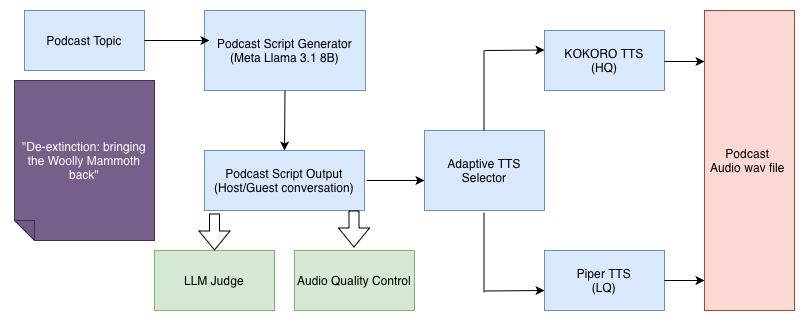

# Wizard of POdz: Adaptive AI Podcast Generator

[](https://opensource.org/licenses/MIT)


> **An adaptive AI system that dynamically balances latency and quality to generate podcast clips**



Wizard of POdz is a production-ready generative AI system that creates podcast introduction clips by intelligently combining Large Language Models with Text-to-Speech synthesis. The system features **adaptive backend switching** that maintains sub-90s response times while maximizing audio quality under varying workloads—achieving up to **3.8× throughput improvement** through dynamic quality-latency tradeoffs.

[Read the technical report](./msgai_adaptive_podcast.pdf) | [Presentation slides](./technical_presentation.pdf) | [View results](#key-results)


---

## Key Features

- **Adaptive Quality-Latency Tradeoff**: Dynamically switches between high-quality (Kokoro) and fast (Piper) TTS backends based on queue conditions
- **Production-Ready Architecture**: M/G/1 queuing model with state-dependent service rates maintains QoS guarantees under load
- **Structured Script Generation**: Meta-LLaMA 3.1 8B generates coherent podcast dialogues with host-guest interactions
- **Multi-Voice Support**: Separate male/female voice assignments with natural conversational flow
- **Scalable Performance**: Handles arrival rates up to 162 requests/hour (0.045 req/s) while maintaining <60s response times

---

## The Problem

Generative AI services face a fundamental challenge: **higher quality typically requires longer inference times**. Static systems must choose between:
- **Fast but mediocre** → Users get quick results but poor experience
- **Excellent but slow** → Users abandon requests due to high latency

**Wizard of POdz solves this** through adaptive switching: maintaining <90s response time constraints while using the highest quality TTS backend the current workload permits.

---

## System Architecture
```
┌─────────────────┐      ┌──────────────────┐      ┌─────────────────┐
│  User Request   │─────▶│  LLM (LLaMA 3.1) │─────▶│  Queue Monitor  │
│  (Topic Input)  │      │  Script Generator │      │  (Adaptive)     │
└─────────────────┘      └──────────────────┘      └────────┬────────┘
                                                              │
                                                              ▼
                                           ┌──────────────────────────────┐
                                           │   Switching Policy           │
                                           │   n × t_k + t_k ≤ 90s?       │
                                           └────────┬────────────┬────────┘
                                                    │            │
                                    ┌───────────────┘            └───────────────┐
                                    ▼                                            ▼
                          ┌──────────────────┐                        ┌──────────────────┐
                          │  Kokoro TTS      │                        │  Piper TTS       │
                          │  43.5s latency   │                        │  11.5s latency   │
                          │  High Quality    │                        │  Fast Generation │
                          └────────┬─────────┘                        └────────┬─────────┘
                                   │                                           │
                                   └─────────────────┬─────────────────────────┘
                                                     ▼
                                          ┌──────────────────┐
                                          │  Audio Output    │
                                          │  70-80s podcast  │
                                          └──────────────────┘
```

### Pipeline Components

1. **LLM Script Generation** (5.4s average)
   - Model: Meta-LLaMA 3.1 8B Instruct
   - Output: Structured dialogue with host/guest labels and gender metadata
   - Configuration: 256 max tokens, 3 few-shot examples

2. **TTS Audio Synthesis** (6-38s average)
   - **Kokoro** (82M params): Premium quality, 43.5s latency, 24kHz sampling
   - **Piper** (15-20M params): Fast generation, 11.5s latency, 22.05kHz sampling

3. **Adaptive Switching Policy**
```python
   if queue_length × t_kokoro + t_kokoro ≤ 90s:
       use_kokoro()  # High quality
   else:
       use_piper()   # Fast fallback
```

---
## Key Results

### Performance Under Load

| Arrival Rate (req/s) | Response Time (s) | Kokoro Usage | Queue Length | Throughput (req/min) |
|---------------------|------------------|--------------|--------------|---------------------|
| 0.015 | 55.9 | 68% | 1.04 | 1.85 |
| 0.025 | 46.4 | 62% | 1.50 | 1.97 |
| 0.035 | 50.3 | 49% | 1.95 | 2.27 |
| 0.045 | 55.5 | 24% | 4.54 | 3.26 |

**Key Findings:**
- Maintained <60s response times across all tested loads (well below 90s constraint)
- Graceful quality degradation: Kokoro usage drops from 68% → 24% under increasing load
- 3.8× throughput advantage over static Kokoro-only strategy
- Linear throughput scaling up to 75.8% of Piper's theoretical capacity

---

## Run the code

### Prerequisites

- Python 3.8+
- NVIDIA GPU (tested on RTX 4090, A100, L4)
- 8GB+ VRAM recommended

### Installation
```bash
# Clone repository
git clone https://github.com/rkaushik97/MSGAI-AI-Podcast-Generator.git
cd MSGAI-AI-Podcast-Generator

# Download Kokoro TTS model files
mkdir kokoro
cd kokoro
wget https://github.com/thewh1teagle/kokoro-onnx/releases/download/model-files-v1.0/kokoro-v1.0.fp16.onnx
wget https://github.com/thewh1teagle/kokoro-onnx/releases/download/model-files-v1.0/voices-v1.0.bin
cd ..

# Create virtual environment
python3 -m venv venv
source venv/bin/activate

# Install dependencies
pip install -r requirements.txt
```

### Basic Usage
```bash
# Navigate to main module
cd podcast-generator

# View all options
python main.py --help
```

---

## Evaluation Methodology

### Offline Analysis
- **Configuration Space**: 20 hyperparameter combinations (5 max token lengths × 4 few-shot counts)
- **Metrics**: Word Error Rate (WER), inference time, word count, format compliance
- **Sample Size**: 200 generated scripts (10 per configuration)

### Online Simulation
- **Queue Model**: M/G/1 with state-dependent service rates
- **Workload Range**: λ ∈ [0.015, 0.045] req/s (54-162 req/hour)
- **Simulation Duration**: 30 minutes per arrival rate
- **Hardware**: NVIDIA RTX 4090, 4-core CPU, 24GB VRAM

### Quality Assessment
Initial experiments with LLM-as-Judge (LLaMA 3.1, Mistral-7B) showed limited discriminative power for high-quality outputs. We pivoted to objective metrics:
- **WER**: Whisper-small ASR transcription accuracy
- **Format Compliance**: Structural validation of metadata and dialogue labels
- **Latency**: End-to-end processing time from request to audio output


---

## Contact

**Kaushik Raghupathruni** - kaushik.raghupathruni@students.unibe.ch
**Sebastian Käslin** - sebastian.kaeslin@unifr.ch  


For questions about the paper, please open an issue or reach out directly.

---

<div align="center">

[⭐ Star this repo](https://github.com/rkaushik97/MSGAI-AI-Podcast-Generator) if you find it useful!

</div>
